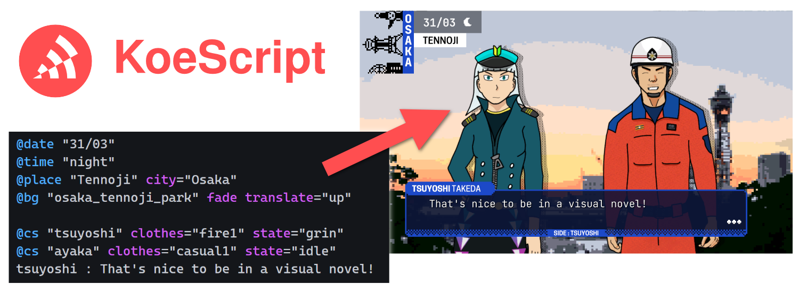

# KoeScript



<h3 align="center"><a href="https://github.com/komanaki/koescript/blob/main/README.md">English</a> • <a href="https://github.com/komanaki/koescript/blob/main/README.ja.md">日本語</a></h3>

KoeScriptとは、ゲーム等で長い物語を楽に書くために新スクリプト言語でございあます。

REPL（read–eval–print loop）のようにも使用できるので、ゲーム内のチャットやコンソールでも役に立てる。

西洋と日本からの昔や現在のゲームが細かく研究したから、言語の構文が決めました。

## ✨ 機能

* プログラマーじゃなくても読みやすい書きやすい
* どんなゲームやアプリに使用するため自身通りに実装できます
* 色んなプロジェクトで辻褄の合うあるために共通な関数とタグがあります
* 構文強調表示などためにVisual Studio Code向けの拡張機能があります

## ⌨️ スクリプト例

```
# これで音量の80パーで音楽を再生しましょう。
@bgm "lonely_moon" volume=0.8

# 壁紙を変更するように関数を呼び。薄りながら下から上まで滑る。
@bg "school_corridor" fade translate="up"

# "guide"と申すキャラが「Hello there!」って言います。
guide : Hello there!

# キャラの名前が書いてなくたら、従前のキャラがまた話すっていう意味です。
That's still me speaking, even without any character information.
```

## 🏁 はじめに

言語の構文を理解できるように、[Language Reference（言語参考）](Language-Reference.md)をお読みください。

もし自分のプロジェクトに共通な関数とタグを実装したいなら、[Common Functions（共通の関数）](Common-Functions.md)そして[Common Tags（共通のタグ）](Common-Tags.md)をお読みください。

公式な実装でどう言語がソードコードになってわかりたいなら、それとも自分の実装を手伝うように、[Implementation Guide（実装ガイド）](Implementation-Guide.md)をお読みください。

## 🔍 実装

高速はKoeScriptにて必要なことじゃなく目的もではなく、原初のC#実装はとても読みやすい理解やすいだし、他の言語へ実装することはとんでもないです。

* [**koescript-cs**](koescript-cs/README.md) : C#言語で原初実装
* [**koescript-unity**](koescript-unity/README.md) : Unityエンジン向けパッケージ
* [**koescript-vscode**](koescript-vscode/README.md) : Visual Studio Code向け拡張機能

## 🤔 どうして？

Unityを利用ながらゼロからノベルゲームを作りがるので、そのうちに自分のスクリプト言語を作りたら面白くなるっと思いました。

検索した後であるエンジンと関係ないのスクリプト言語は少ないってわかりましたから、他のプロジェクトにも使えるようにスクリプト言語の開発を開始しました。

非常に難しい実装を書きたくないので初心者プログラマーが理解できるし、それから学ぶになれるし、ソースコードの理解をやってみるのは面白いチャレンジになるように作りました。

## 🎮 使えるプロジェクト

* [リボルターレコード・ZERO-Sum Chaos](https://www.michaelhubert.me/ja/revolter-record/) : 世界中で起きた災害で現れた幽霊に対応するの公務員と市民の物語

＊ここにプロジェクトが表示したい場合は遠慮なくプルリクエストを開けてください。

## 🤝 コントリビュートする方法

出来たばっかりプロジェクトだからこそ、どんな提案でもよろしく受け取れます。その前、必ず[Contributing（コントリビュートする方法）](CONTRIBUTING.md)をお読みきださい。

このプロジェクトは[Code of conduct（行動規範）](CODE_OF_CONDUCT.md)に則っているので、読んでくれて感謝します。

## ⚖️ ライセンス

KoeScript言語、C#原初実装、Unityエンジン向けパッケージ、VSCode向け拡張機能はすべてMIT Licenceもとに提要されています。詳しくは、プロジェクトごとにの添付LICENCEファイルをご覧ください。
