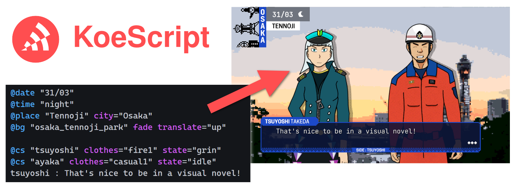

# KoeScript



KoeScript is a new **lightweight scripting language** aimed for a pleasant writing of long **dialogues** in video games, especially in visual novels.

It can also be used like a **REPL** (read–eval–print loop), making it perfect for in-game chat or scripting console as well.

The language syntax has taken inspiration from both old and recent scripting languages used by many games in the West and in Japan.

## ✨ Features

* Easy to **read and write**, even as a non-programmer
* Can be **implemented as you want** to fit any game or application
* **Common functions and tags** proposed to ensure a coherent usage between projects
* **Language extension** for the Visual Studio Code IDE, with syntax highlighting

## ⌨️ Sample script

```
# Function call setting a background music
@bgm "lonely_moon" volume=0.8

# Function call setting the background image, with a fade and animating from bottom to top
@bg "school_corridor" fade translate="up"

# Character "guide" saying something
guide : Hello there!

That's still me speaking, even without any character information.
```

## 🏁 How to start

To know more about the language syntax, read the [**Language Reference**](Language-Reference.md).

If you want to implement the suggested common functions and tags inside your game or application, consult the [**Common Functions**](Common-Functions.md) reference and the [**Common Tags**](Common-Tags.md) reference.

To understand in-depth how the KoeScript language is represented in the source code of the official implementations, or if you want tips for integration into your game or application, please read the [**Implementation Guide**](Implementation-Guide.md)

## 🔍 Implementations

As extreme performance is neither a requirement nor a goal for KoeScript, its original parser and interpreter in C# is fairly simple to understand and replicate in other languages if needed.

* [**koescript-cs**](koescript-cs/README.md) : The original and reference implementation in C#.
* [**koescript-unity**](koescript-unity/README.md) : The official package for language support in the Unity engine.
* [**koescript-vscode**](koescript-vscode/README.md) : The Visual Studio Code extension for syntax highlighting and more.

## 🤔 Why ?

As I wanted to create a visual novel "from scratch" using the Unity game engine, I thought it could be interesting to create my own scripting language as well.

I found out that implementation agnostic scripting languages were quite rare, so I've decided to do it that way so that it could benefit many other games or applications as well.

As I didn't want to write a too complicated parser, I've made it straightforward so that beginner or intermediate-level developers could understand it, learn from it, and maybe think of it as an interesting challenge.

## 🎮 As seen on...

* [ReVolter Record : ZERO-Sum Chaos](https://www.michaelhubert.me/revolter-record/) : A visual novel about a global disaster confronting governments and rebellious citizens against malicious spirits

_Don't refrain from opening a pull request to add your game or application here !_

## 🤝 How to contribute

As a fresh project, we're open to any contribution. Please make sure to read the [Contributing](CONTRIBUTING.md) file to know how to.

This project follows a [code of conduct](CODE_OF_CONDUCT.md) which you're invited to read before contributing.

## ⚖️ License

The KoeScript language, its C# reference implementation, its Unity extension and its VS Code extension are released under the MIT License. See the bundled LICENSE file of each project for details.
