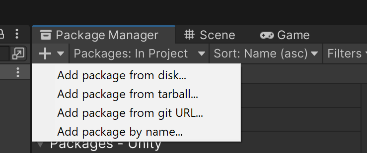

# KoeScript-Unity

This is the official Unity package for KoeScript support inside the [Unity](https://unity.com/) engine.

The `Core` folder of the [**KoeScript-CS**](../koescript-cs/) project should just be copied without modifications inside the `Runtime` folder of this project.

Further modifications made especially for the Unity engine could appear under the `Runtime/Unity/` folder.

## Building the project

There is nothing to build as the source code will be included as-is inside the project where the package will be installed.

## Installing the package in Unity

The recommended way is to add this package through the **Package Manager**. If its window is not open yet in your Editor view, you can open it from the top main menu : **Window > Package Manager**.

Then, you'll have to click the very tiny `+` button to add a new package using this folder content.

In the submenu, choose **Add package from git URL...** and write the following URL :

`https://github.com/komanaki/koescript.git?path=/koescript-unity`
